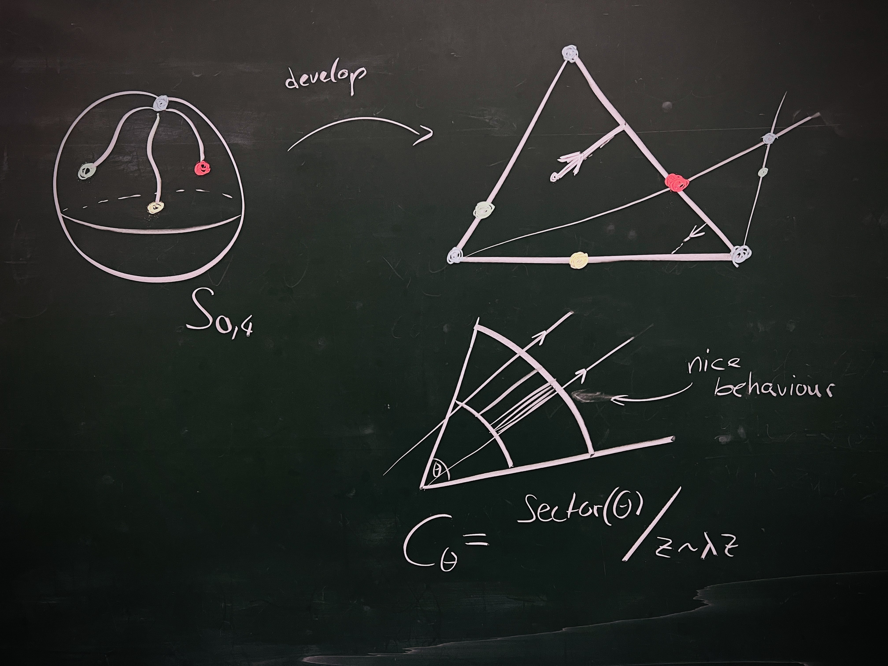

  <!-- Profile Section -->
  

    

      

        <h1 class="profile-name">Fabian Lander</h1>
        
PhD Student at Max Planck Institute for Mathematics in the Sciences in Leipzig, Germany

        
        

          <a href="https://github.com/FabianLander" class="social-button github" aria-label="GitHub profile of Fabian Lander">
            <i class="fab fa-github"></i>
          </a>
          <a href="https://linkedin.com/in/fabian-lander-b88286339" class="social-button linkedin" aria-label="LinkedIn profile of Fabian Lander">
            <i class="fab fa-linkedin"></i>
          </a>
          <a href="mailto:fabian.lander[you know what goes here]mis[dot]mpg[dot]de" class="social-button email" aria-label="Email Fabian Lander">
            <i class="fas fa-envelope"></i>
          </a>
        

      

      

        <picture>
          <source srcset="assets/images/IMG_2886.webp" type="image/webp">
          
        </picture>
      

    

  

  <!-- Tabs Navigation -->
  

    <button class="tab-button" data-tab="about">About</button>
    <button class="tab-button" data-tab="projects">Current Projects</button>
  

  <!-- Tab Content -->
  

    

      
Hello! I'm a first-year PhD student in the Geometry, Groups and Dynamics division at the Max Planck Institute for Mathematics in the Sciences in Leipzig, Germany. I work under the supervision of James Farre as part of Anna Wienhard's research group.

      
      
My research focuses on straight line foliations on half-dilation surfaces on punctured spheres. Here's a typical picture I would draw on a blackboard if someone would ask me what I work on:

      
      

        <picture>
          <source srcset="assets/images/IMG_6794.webp" type="image/webp">
          
        </picture>
      

      
      
Before starting my PhD, I worked on polygonal symplectic billiards, where we proved several theorems about their dynamics.

    

  

  

    

      <h2>Current Projects</h2>
      
[Under Construction]

    

  

<!-- Optimized Font Awesome loading -->
<link rel="preload" href="https://cdnjs.cloudflare.com/ajax/libs/font-awesome/5.15.4/css/fontawesome.min.css" as="style">
<link rel="preload" href="https://cdnjs.cloudflare.com/ajax/libs/font-awesome/5.15.4/css/brands.min.css" as="style">
<link rel="preload" href="https://cdnjs.cloudflare.com/ajax/libs/font-awesome/5.15.4/css/solid.min.css" as="style">

<link rel="stylesheet" href="https://cdnjs.cloudflare.com/ajax/libs/font-awesome/5.15.4/css/fontawesome.min.css">
<link rel="stylesheet" href="https://cdnjs.cloudflare.com/ajax/libs/font-awesome/5.15.4/css/brands.min.css">
<link rel="stylesheet" href="https://cdnjs.cloudflare.com/ajax/libs/font-awesome/5.15.4/css/solid.min.css">

